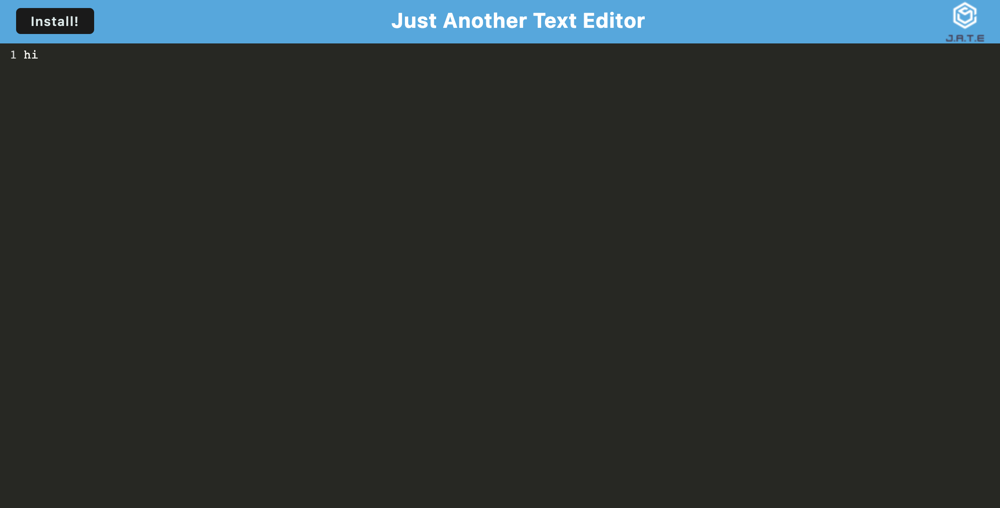

# Text-Editor
## Description
I added a service worker so that the application works offline and has the ability to cache assets. Additionally, I implement sessiondb to store data. 

## Screenshot 

## Link
[Link](https://text-editor4242-26ded7559bee.herokuapp.com/)